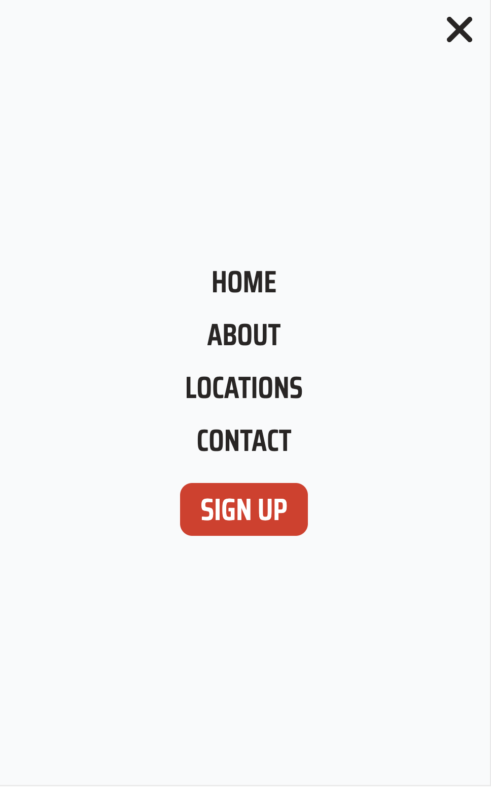

# WorldFitness App

## Desktop Version

## Tablet Version

## Mobile Version

<table>
  <tbody>
    <tr>
      <td style="vertical-align:top;">
        
      </td>
      <td style="vertical-align:top;">
        
      </td>
    </tr>
  </tbody>
</table>

